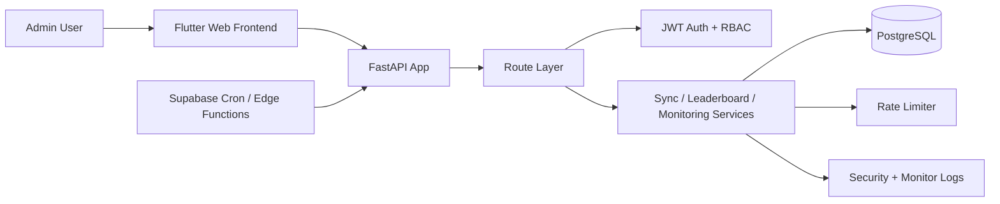

# LeetCode Tracker API

## Overview

LeetCode Tracker API is a FastAPI backend that powers the Flutter web frontend for leaderboard, analytics, admin operations, monitoring, and token-based session management. It stores user and snapshot data in PostgreSQL and exposes both public and admin-protected routes.

- Backend repo path: `leetcode_tracker_web_api/`
- Frontend repo path: `../leetcode_tracker_web/`

## HLD



## Features

- Public leaderboard endpoints for latest, weekly, global, and user snapshot views
- Aggregated analytics dashboard endpoint for the frontend analytics page
- Admin login, refresh, logout, and logout-all flows
- Refresh token rotation with reuse-detection and family revocation
- Admin user management and manual sync operations
- Health and monitor endpoints for operational visibility
- Structured security event logging

## Monitoring

Monitoring support is available through:

- `GET /api/v1/health`
- `GET /api/v1/health/deps`
- `GET /api/v1/health/monitor`

Monitor capabilities include:

- refresh token cleanup status
- recent in-memory logs
- rate limiter backend visibility
- configured external dependency probes
- ad hoc extra probe URLs from the frontend monitor screen

Configuration:

- `MONITOR_CHECK_URLS`
- `MONITOR_HTTP_TIMEOUT_SECONDS`

Note:

- monitor checks use direct HTTP probes from the API process
- protected URLs need additional design if header-based probing is required

## Rate Limiter

Rate limiting is enabled around auth and admin-sensitive routes.

- Redis-backed limiting is used when `REDIS_URL` is configured and reachable
- the app falls back to in-memory limiting if Redis is unavailable
- limiter backend mode is surfaced through monitoring

Related settings:

- `REDIS_URL`
- `RATE_LIMIT_REDIS_PREFIX`

## RBAC

Role-based access is intentionally narrow.

- public routes: leaderboard and health basics
- admin-only routes: admin management, sync, and monitor report
- admin access tokens must contain:
  - `role=admin`
  - `typ=access`
  - an allowed email from `ADMIN_EMAILS`

Refresh tokens are long-lived but are not accepted for route authorization directly.

## Coverage

Backend coverage in this repo includes:

- auth and refresh lifecycle behavior
- monitor endpoint tests
- config validation tests
- cleanup and monitoring support tests

Useful test locations:

- `tests/test_monitor_and_cleanup.py`
- `tests/test_config_validation.py`
- `tests/conftest.py`

Run tests:

```bash
pytest -q
```

## Main Routes

- `POST /api/v1/auth/admin/login`
- `POST /api/v1/auth/refresh`
- `POST /api/v1/auth/logout`
- `POST /api/v1/auth/logout-all`
- `GET /api/v1/health`
- `GET /api/v1/health/deps`
- `GET /api/v1/health/monitor`
- `GET /api/v1/leaderboard/latest`
- `GET /api/v1/leaderboard/weekly`
- `GET /api/v1/leaderboard/global`
- `GET /api/v1/leaderboard/dashboard`
- `GET /api/v1/leaderboard/users/{user_id}/snapshots`
- `GET /api/v1/admin/users`
- `POST /api/v1/admin/users`
- `DELETE /api/v1/admin/users/{user_id}`
- `POST /api/v1/admin/sync/daily`

## Deployment Instructions

### Local

```bash
python -m venv .venv
. .venv/bin/activate
pip install -r requirements.txt
alembic upgrade head
uvicorn app.main:app --reload
```

On Windows PowerShell:

```powershell
python -m venv .venv
.venv\Scripts\Activate.ps1
pip install -r requirements.txt
alembic upgrade head
uvicorn app.main:app --reload
```

### Required Environment

At minimum configure:

- `DATABASE_URL`
- `ADMIN_EMAILS`
- `ADMIN_PASSWORD`
- `JWT_SECRET_KEY`
- `ALLOWED_ORIGINS`

Operationally useful settings:

- `JWT_ACCESS_TOKEN_EXPIRE_MINUTES`
- `JWT_REFRESH_TOKEN_EXPIRE_DAYS`
- `MAX_ACTIVE_REFRESH_TOKEN_FAMILIES_PER_ADMIN`
- `REFRESH_TOKEN_CLEANUP_INTERVAL_MINUTES`
- `REFRESH_TOKEN_CLEANUP_RETENTION_DAYS`
- `MONITOR_CHECK_URLS`
- `MONITOR_HTTP_TIMEOUT_SECONDS`
- `REDIS_URL`

### Hosted

- deploy the API to your host of choice such as Render
- set the frontend `API_BASE_URL` to this backend origin
- allow the frontend origin in `ALLOWED_ORIGINS`
- verify `/api/v1/health` before pointing production traffic at it

### Keep-Warm Support

If using Render free/sleeping infrastructure, this repo also works with a Supabase keep-warm flow documented in:

- [../leetcode_tracker_web/supabase/functions/keep-render-warm/README.md](../leetcode_tracker_web/supabase/functions/keep-render-warm/README.md)

## E2E Script

The companion frontend repo includes a PowerShell smoke script:

- [../leetcode_tracker_web/scripts/smoke_e2e.ps1](../leetcode_tracker_web/scripts/smoke_e2e.ps1)

It is useful after deployment to verify:

- health endpoint availability
- admin login
- refresh token rotation
- monitor access
- logout-all behavior
